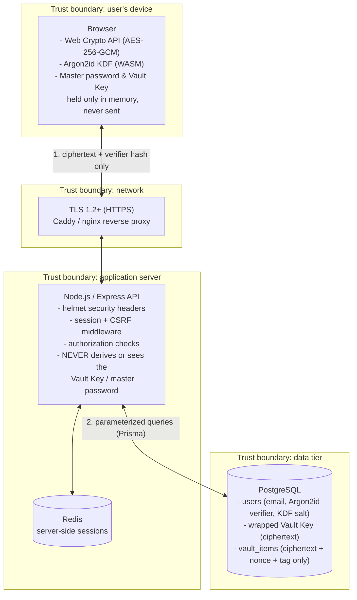

# Checkpoint 1: Threat Model & Architecture

Project: **Web-Based Secure Password Manager**
Course: ICS0027 Web Application Security, Week 4

## 1. Scope

A web application that lets a user store, retrieve and organize login
credentials ("vault items") behind a single master password. The core
security property is **zero-knowledge**: the server and its database only
ever hold ciphertext, salts and password verifiers. The plaintext master
password and the decrypted vault never leave the browser.

In scope for the semester project:

- Registration / login with a master password, session-based auth.
- Client-side key derivation and encryption/decryption of vault items.
- CRUD on vault items (title, username, password, URL, notes), all encrypted.
- CSRF and XSS-hardened rendering of user-supplied vault content.
- Optional stretch goal: TOTP-based multi-factor authentication.

Out of scope: password sharing between users, browser extension/autofill,
breach-monitoring integrations.

## 2. System Architecture

**Where encryption happens:** exclusively in the browser. The master
password is fed into Argon2id together with a per-user salt to derive a
Master Key; the Master Key unwraps a random 256-bit Vault Key; the Vault Key
encrypts/decrypts individual vault items with AES-256-GCM. Only ciphertext,
nonces, auth tags, salts and a one-way login verifier ever cross the network
boundary.

**Trust boundaries:**

1. **User device to network:** the browser is trusted with plaintext; the
   network is not (hence TLS everywhere, no exceptions).
2. **Network to application server:** the server is trusted to route,
   authenticate and authorize requests, but is *not* trusted with plaintext
   vault data or the master password.
3. **Application server to data tier:** the database is trusted even less
   than the app server: it must remain safe to leak (ciphertext only) and is
   reached only through parameterized queries, never raw SQL built from
   request input.

## 3. Threat Model

Mapped to the **OWASP Top 10 (2025)** and to the attack classes covered in
Weeks 1-4 (HTTP/cookies, client-side controls & HTML injection, XSS).

| # | Threat / scenario | Category | Mitigation |
|---|---|---|---|
| 1 | Attacker changes a vault item ID in the URL/body and reads or edits another user's credentials (IDOR). | A01:2025 Broken Access Control | Every vault query is scoped server-side by the session's user ID, never by a client-supplied user/owner field; deny-by-default authorization middleware on all `/api/vault/*` routes. |
| 2 | Verbose error pages, default DB credentials, or an exposed debug endpoint leak internals. | A02:2025 Security Misconfiguration | `helmet` security headers, generic error responses in production, no default accounts, secrets only via environment variables / `.env` (never committed), least-privilege DB role. |
| 3 | A compromised npm dependency (e.g. a crypto or logging package) exfiltrates master passwords from memory. | A03:2025 Software Supply Chain Failures | Lockfile committed, `npm audit`/Dependabot in CI, minimal dependency surface for anything touching secrets, pin and review versions before upgrading. |
| 4 | Server or DB breach exposes vault contents; weak KDF lets a stolen verifier be brute-forced offline. | A04:2025 Cryptographic Failures | Zero-knowledge design (§4): server never holds plaintext or the Vault Key; Argon2id with OWASP-recommended cost parameters; AES-256-GCM with a unique nonce per item; TLS 1.2+ in transit. |
| 5 | `' OR '1'='1` style payload in the login or search field against the database. | A05:2025 Injection | All DB access through Prisma parameterized queries/ORM, never string-concatenated SQL; strict schema validation (allow-list) on every request body. |
| 6 | Attacker stores a `<form>`/`<meta>` tag in a vault item's title or notes field that renders as a fake login prompt to phish the master password (HTML injection / content spoofing, Week 3). | Week 3: HTML Injection & Content Spoofing | Vault content is always rendered as text (React's default escaping, never `dangerouslySetInnerHTML`); strict Content-Security-Policy (no inline scripts/forms) as defense in depth. |
| 7 | Stored XSS payload in a vault field runs JavaScript that reads the decrypted vault from the DOM/memory or exfiltrates the session cookie. | Week 4 / A05: Cross-Site Scripting | Output encoding on every render path; CSP with no `unsafe-inline`; session cookie marked `HttpOnly` so it is unreadable even if a script executes; input length/type validation. |
| 8 | Attacker disables a client-side password-strength check or rate-limit via devtools/Burp and submits a weak master password or brute-forces `/login` directly against the API (client-side control bypass, Week 3). | Week 3: Bypassing Client-Side Controls | Every client-side check is duplicated server-side (password policy, field limits); server never trusts a client-reported security decision (e.g. "already validated"). |
| 9 | Attacker edits a hidden field or JSON body parameter (`user_id`, `vault_id`, `role`) in transit to act on another user's data (input tampering, client-server communication). | Client-Server Communication: Input Tampering | Server identity comes only from the authenticated session, never from client-supplied identifiers; strict request schema validation rejects unexpected/extra fields. |
| 10 | Credential stuffing or brute force against `/login`; session fixation by pre-setting a victim's session ID. | A07:2025 Authentication Failures | Argon2id-hashed login verifier, rate limiting + progressive lockout on auth endpoints, session ID regenerated on every successful login (§5), optional TOTP MFA. |
| 11 | A malicious page auto-submits a request (e.g. "delete vault item", "change master password") using the victim's live session (CSRF). | A01/CSRF (Week 10 preview, relevant from first auth flow) | `SameSite=Strict` session cookie, synchronizer CSRF token required on all state-changing requests, re-authentication required for changing the master password or exporting the vault. |
| 12 | Mass export or repeated failed logins go unnoticed because nothing is logged. | A09:2025 Security Logging & Alerting Failures | Structured audit log of auth events and vault access (metadata only, never secrets), alerting thresholds on failed logins / bulk export. |

## 4. Technology Stack

| Layer | Choice | Justification |
|---|---|---|
| Backend framework | Node.js 20 + Express + TypeScript | Mature security middleware ecosystem (`helmet`, `express-session`, `express-rate-limit`), non-blocking I/O suits an API that is mostly small JSON/ciphertext payloads, static typing catches request/response shape bugs early. |
| Database | PostgreSQL + Prisma ORM | Parameterized queries by default (mitigates A05 Injection), relational integrity between users/vault items/sessions, straightforward migrations, first-class Docker support for local dev. |
| Client-side crypto | Web Crypto API (`SubtleCrypto`, AES-256-GCM) + Argon2id (WASM, `argon2-browser`) | Native browser crypto avoids shipping a hand-rolled cipher; Argon2id is OWASP's current recommendation for password-based key derivation (memory-hard, resists GPU/ASIC cracking) versus faster hashes like bcrypt/PBKDF2. |
| Server-side auth hashing | `node-argon2` (libsodium binding) | Server independently re-hashes the client-sent verifier before storage, so a DB leak alone is not enough to impersonate a user even if the verifier logic were reused elsewhere. |
| Session store | Redis via `express-session` | Server-side sessions can be revoked instantly (logout-everywhere, admin action), unlike stateless JWTs; fast in-memory store fits the low-latency session lookups needed on every request. |
| Reverse proxy / TLS | Caddy (or nginx) terminating TLS in front of the Node app | Automatic certificate management (Let's Encrypt) in production; local development uses a self-signed cert via `mkcert` so HTTPS-only behaviors (secure cookies, HSTS) can be tested locally instead of assumed. |

**TLS plan:** TLS 1.2+ only, HTTP requests redirected to HTTPS, `HSTS`
enabled once the certificate chain is verified in each environment. No
application route is ever served over plain HTTP outside of local dev.

## 5. Authentication & Session Model

- **Cookie:** `HttpOnly`, `Secure`, `SameSite=Strict`, `Path=/`. The session
  cookie is never readable from JavaScript, so it survives an XSS bug that
  the CSP/output-encoding layers failed to stop.
- **Lifetime:** 15-minute idle timeout, 12-hour absolute maximum; the vault
  additionally auto-locks client-side (decrypted data wiped from memory)
  after a shorter inactivity period.
- **Fixation prevention:** the session ID is regenerated
  (`req.session.regenerate`) immediately after a successful login, and any
  pre-authentication session is discarded rather than "upgraded" in place.
- **CSRF:** synchronizer token pattern. A per-session token is required on
  every non-GET request and validated server-side before the request is
  processed.
- **Brute-force protection:** rate limiting and progressive lockout on
  `/api/auth/login` and `/api/auth/register`, independent of any client-side
  throttling (see threat #8).
- **Multi-factor authentication (stretch goal):** TOTP (RFC 6238) as a second
  factor, required at login and again before the wrapped Vault Key is
  released to the client. Planned after the Checkpoint 2 core flow is
  working.

## 6. Cryptographic Design

Goal: the server should be able to leak its entire database without
exposing any user's master password or vault contents.

1. **Registration.** The server generates a random per-user KDF salt and
   returns it to the client. It is never treated as secret.
2. **Master Key.** The browser computes
   `MasterKey = Argon2id(masterPassword, salt, params)` locally. The master
   password and Master Key never leave the browser.
3. **Login verifier.** The browser derives a second value,
   `AuthHash = HKDF(MasterKey, "auth")`, and sends *that* to the server,
   never the Master Key or the password itself. The server hashes it again
   with Argon2id before storing it, so the stored verifier cannot be used
   directly even if leaked, and cannot be reversed into the Master Key.
4. **Vault Key.** At registration the browser also generates a random
   256-bit Vault Key and encrypts ("wraps") it with the Master Key
   (AES-256-GCM). Only the wrapped (ciphertext) Vault Key is sent to and
   stored by the server. This indirection means changing the master
   password only requires re-wrapping the Vault Key, not re-encrypting every
   vault item.
5. **Vault items.** Each item is encrypted client-side with the Vault Key
   (AES-256-GCM, a fresh random nonce per item). The server stores and
   returns only `{ciphertext, nonce, authTag}` per item plus non-sensitive
   metadata (timestamps, item ID).

**What the database stores:** email/username, KDF salt, Argon2id(AuthHash)
verifier, wrapped Vault Key ciphertext, per-item ciphertext/nonce/tag.
**What it never stores:** the master password, the Master Key, the Vault
Key in plaintext, or any decrypted vault content.

## 7. Repository

See the top-level [README](../README.md) for scope, planned routes and how
to run the current scaffold locally. This checkpoint intentionally ships
only a minimal backend health check and a placeholder frontend page. The
registration/login flow, client-side crypto and vault CRUD are Checkpoint 2
work.
