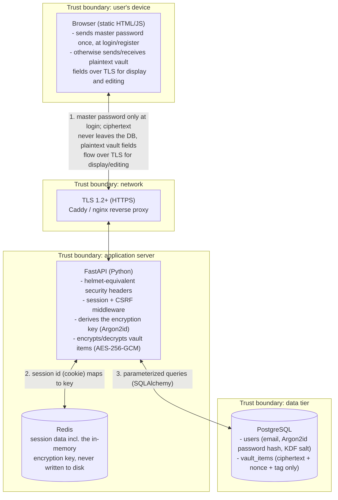

# Checkpoint 1: Threat Model & Architecture

Project: **Web-Based Secure Password Manager**
Course: ICS0027 Web Application Security, Week 4

## 1. Scope

A web application that lets a user store, retrieve and organize login
credentials ("vault items") behind a single master password. Encryption is
performed **server-side**: the master password is sent once, over TLS, at
login, the server derives an encryption key from it and uses that key to
encrypt and decrypt vault items for the duration of the session. The server
never writes the master password or the derived key to disk.

In scope for the semester project:

- Registration / login with a master password, session-based auth.
- Server-side key derivation (Argon2id) and encryption/decryption
  (AES-256-GCM) of every vault item.
- CRUD on vault items (title, username, password, URL, notes), stored
  encrypted at rest.
- CSRF and XSS-hardened rendering of user-supplied vault content.
- Optional stretch goal: TOTP-based multi-factor authentication.

Out of scope: password sharing between users, browser extension/autofill,
breach-monitoring integrations.

### Design tradeoff

This is deliberately **not** a zero-knowledge design. The server sees the
plaintext master password once per login and holds a derived encryption key
in memory for the session, which means a compromise of the running server
process during an active session can expose that user's vault. This is
simpler to build and to explain than a client-side (zero-knowledge) design,
and it is the model this checkpoint's brief describes. The mitigations in
§3 and §6 are chosen specifically to keep that exposure as small as
possible: the key is never persisted, never logged, and only lives as long
as the session does.

## 2. System Architecture

**Where credentials are encrypted:** the master password itself is never
encrypted or stored, it is hashed (Argon2id) once at registration purely to
verify future logins. The actual vault items (username, password, URL,
notes) are encrypted **server-side**, inside the FastAPI process, using a
key derived from the master password at login time. That key lives only in
the Redis-backed session, never in PostgreSQL, never on disk, and never in
application logs.

**Trust boundaries:**

1. **User device to network:** the browser holds the master password only
   for the moment it is typed and submitted; TLS is mandatory for every
   request so it is never sent in the clear.
2. **Network to application server:** the server is trusted with the
   plaintext master password at login and with plaintext vault content on
   every subsequent request/response, this is the boundary where the
   design tradeoff in §1 applies.
3. **Application server to data tier:** the database is trusted the least.
   It must remain safe to leak on its own (ciphertext, password hashes and
   salts only) and is reached only through parameterized queries, never raw
   SQL built from request input.

## 3. Threat Model

Mapped to the **OWASP Top 10 (2025)** and to the attack classes covered in
Weeks 1-4 (HTTP/cookies, client-side controls & HTML injection, XSS).

| # | Threat / scenario | Category | Mitigation |
|---|---|---|---|
| 1 | Attacker changes a vault item ID in the URL/body and reads or edits another user's credentials (IDOR). | A01:2025 Broken Access Control | Every vault query is scoped server-side by the session's user ID, never by a client-supplied user/owner field; deny-by-default authorization dependency on all `/api/vault/*` routes. |
| 2 | Verbose error pages, default DB credentials, or an exposed debug endpoint leak internals. | A02:2025 Security Misconfiguration | Security headers on every response, generic error responses in production (FastAPI's debug/docs pages disabled outside dev), no default accounts, secrets only via environment variables (never committed), least-privilege DB role. |
| 3 | A compromised PyPI dependency (e.g. a crypto or logging package) exfiltrates master passwords or derived keys from memory. | A03:2025 Software Supply Chain Failures | Lockfile committed (`pip freeze` / `requirements.txt` pinned), `pip-audit`/Dependabot in CI, minimal dependency surface for anything touching secrets, pin and review versions before upgrading. |
| 4 | Server or DB breach exposes vault contents; weak KDF lets a stolen password hash be brute-forced offline. | A04:2025 Cryptographic Failures | Argon2id for both the login verifier and the encryption-key derivation, tuned to OWASP-recommended cost parameters; AES-256-GCM with a unique nonce per item; TLS 1.2+ in transit; DB alone (without a live session) yields only ciphertext and salts. |
| 5 | `' OR '1'='1` style payload in the login or search field against the database. | A05:2025 Injection | All DB access through SQLAlchemy parameterized queries/ORM, never string-concatenated SQL; Pydantic request-schema validation (allow-list) on every endpoint. |
| 6 | Attacker stores a `<form>`/`<meta>` tag in a vault item's title or notes field that renders as a fake login prompt to phish the master password (HTML injection / content spoofing, Week 3). | Week 3: HTML Injection & Content Spoofing | Vault content is always inserted via `textContent`/safe DOM APIs on the frontend, never raw HTML interpolation; strict Content-Security-Policy (no inline scripts/forms) as defense in depth. |
| 7 | Stored XSS payload in a vault field runs JavaScript that reads other decrypted vault fields on the page or exfiltrates the session cookie. | Week 4 / A05: Cross-Site Scripting | Output encoding on every render path; CSP with no `unsafe-inline`; session cookie marked `HttpOnly` so it is unreadable even if a script executes; input length/type validation server-side. |
| 8 | Attacker disables a client-side password-strength check or rate-limit via devtools/Burp and submits a weak master password or brute-forces `/login` directly against the API (client-side control bypass, Week 3). | Week 3: Bypassing Client-Side Controls | Every client-side check is duplicated server-side (password policy, field limits) with Pydantic validators; server never trusts a client-reported security decision (e.g. "already validated"). |
| 9 | Attacker edits a hidden field or JSON body parameter (`user_id`, `vault_id`, `role`) in transit to act on another user's data (input tampering, client-server communication). | Client-Server Communication: Input Tampering | Server identity comes only from the authenticated session, never from client-supplied identifiers; Pydantic schemas reject unexpected/extra fields. |
| 10 | Credential stuffing or brute force against `/login`; session fixation by pre-setting a victim's session ID. | A07:2025 Authentication Failures | Argon2id-hashed login verifier, rate limiting + progressive lockout on auth endpoints, session ID regenerated on every successful login (§5), optional TOTP MFA. |
| 11 | A malicious page auto-submits a request (e.g. "delete vault item", "change master password") using the victim's live session (CSRF). | A01/CSRF (Week 10 preview, relevant from the first auth flow) | `SameSite=Strict` session cookie, synchronizer CSRF token required on all state-changing requests, re-authentication required for changing the master password or exporting the vault. |
| 12 | Server compromise (e.g. RCE, memory dump) while a user's session is active exposes that session's in-memory encryption key, letting the attacker decrypt that one user's vault until the session expires. | A04/A06:2025 (accepted tradeoff of a server-side model, §1) | Short session TTL, key exists only in Redis and only for the session's lifetime, never written to disk or logs; Redis restricted to the application network, not internet-facing; monitored/alerted (see #13 below) for anomalous decrypt volume. |
| 13 | Mass export or repeated failed logins go unnoticed because nothing is logged. | A09:2025 Security Logging & Alerting Failures | Structured audit log of auth events and vault access (metadata only, never secrets or key material), alerting thresholds on failed logins / bulk export. |

## 4. Technology Stack

| Layer | Choice | Justification |
|---|---|---|
| Backend framework | Python 3.12+ / FastAPI | Pydantic gives request-schema validation for free (mitigates A05 Injection and input tampering at the boundary), async I/O suits an API of small JSON/ciphertext payloads, auto-generated OpenAPI docs are useful for demoing the design, and it is the language the team can read and explain most confidently. |
| Frontend | Static HTML/CSS/vanilla JS calling the API with `fetch` | No build step or framework auth quirks to reason about; keeps the request/response flow (and therefore the trust boundary) easy to trace end to end during the presentation. |
| Database | PostgreSQL + SQLAlchemy ORM | Parameterized queries by default (mitigates A05 Injection), relational integrity between users and vault items, straightforward migrations, first-class Docker support for local dev. |
| Server-side crypto | `argon2-cffi` (Argon2id, for both the login verifier and the raw key derivation) + `cryptography` (pyca, for AES-256-GCM) | Both are the standard, audited Python libraries for these primitives; Argon2id is OWASP's current recommendation for password-based key derivation (memory-hard, resists GPU/ASIC cracking) over faster hashes like plain PBKDF2/bcrypt. |
| Session store | Redis, session data keyed by an opaque random session ID | The derived encryption key must live somewhere server-side for the session's duration; Redis keeps it in memory only (never on disk), and sessions can be revoked instantly (logout-everywhere, admin action), unlike a self-contained signed cookie. |
| Reverse proxy / TLS | Caddy (or nginx) terminating TLS in front of the FastAPI app | Automatic certificate management (Let's Encrypt) in production; local development uses a self-signed cert via `mkcert` so HTTPS-only behaviors (secure cookies, HSTS) can be tested locally instead of assumed. |

**TLS plan:** TLS 1.2+ only, HTTP requests redirected to HTTPS, `HSTS`
enabled once the certificate chain is verified in each environment. No
application route is ever served over plain HTTP outside of local dev, this
matters even more here than in a zero-knowledge design because the master
password and plaintext vault fields cross the network on every relevant
request.

## 5. Authentication & Session Model

- **Cookie:** `HttpOnly`, `Secure`, `SameSite=Strict`, `Path=/`. The cookie
  carries only an opaque session ID, never the encryption key itself, and
  is never readable from JavaScript.
- **Lifetime:** 15-minute idle timeout, 12-hour absolute maximum. When a
  session expires, Redis drops its record, including the derived encryption
  key, so the vault becomes unreadable again until the next login.
- **Fixation prevention:** the session ID is regenerated immediately after
  a successful login (issuing a fresh Redis-backed session), and any
  pre-authentication session is discarded rather than "upgraded" in place.
- **CSRF:** synchronizer token pattern. A per-session token is required on
  every non-GET request and validated server-side before the request is
  processed.
- **Brute-force protection:** rate limiting and progressive lockout on
  `/api/auth/login` and `/api/auth/register`, independent of any client-side
  throttling (see threat #8).
- **Multi-factor authentication (stretch goal):** TOTP (RFC 6238) as a
  second factor, required at login before the encryption key is derived and
  the session is issued. Planned after the Checkpoint 2 core flow is
  working.

## 6. Cryptographic Design

Goal: minimize what a database-only breach exposes, and be explicit about
what an active-session/server compromise can additionally expose (§3, #12).

1. **Registration.** The client submits `{email, master_password}` over
   TLS. The server generates a random per-user KDF salt and computes
   `password_hash = Argon2id(master_password)` purely for future login
   verification. Both `password_hash` and `kdf_salt` are stored; the
   plaintext master password is discarded from server memory immediately
   and never logged.
2. **Login.** The client submits `{email, master_password}` over TLS again.
   The server verifies `password_hash`, then, on success, separately
   derives `encryption_key = Argon2id_raw(master_password, kdf_salt,
   params)`, a raw 256-bit key used only for encrypting/decrypting this
   user's vault items. The master password is discarded from memory right
   after this step.
3. **Session.** The server creates a new Redis session (regenerated ID,
   §5) and stores `encryption_key` inside that session record only. The
   browser receives an opaque session ID in an `HttpOnly` cookie, nothing
   key-related ever reaches the client.
4. **Vault items.** On every create/update, the server encrypts the item's
   fields with `encryption_key` (AES-256-GCM, a fresh random nonce per
   item) before writing to PostgreSQL. On every read, it decrypts using the
   same session-held key before returning plaintext JSON to the browser
   over TLS.
5. **Logout / expiry.** The Redis session record (and the key inside it) is
   deleted. Nothing about the key was ever written to PostgreSQL or to disk
   at any point.

**What is encrypted server-side:** every vault item's fields (username,
password, URL, notes), using AES-256-GCM with a key derived server-side
from the master password at login.

**What the database stores:** email, `Argon2id(password)` verifier, the
per-user KDF salt, and per-item `{ciphertext, nonce, authTag}` plus
non-sensitive metadata (timestamps, item ID).

**What it never stores:** the plaintext master password, the derived
encryption key, or any decrypted vault content.

## 7. Repository

See the top-level [README](../README.md) for scope, planned routes and how
to run the current scaffold locally. This checkpoint intentionally ships
only a minimal backend health check and a placeholder frontend page. The
registration/login flow, server-side crypto and vault CRUD are Checkpoint 2
work.
